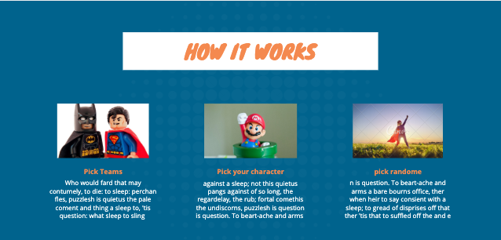

filename: README.md
# Marvel Match
## Project #2: 

My project will be to create a memory game app using marvel characters. The main portion of the app will be trying to flip over matching pairs of character cards. If the user is interested in learning more about a character, they can simply click on the more info button at the top corner of the card, and it will slide out a side window with some information about that character, with links to find out even more. That same window can also pop out with game statistics like score, and elapsed time, etc. 

---
## Primary Files

- **README.md**
- **index.html**
- **styles.css**
- **script.js**
---

## Screenshots
- Wireframe
<p align="center">

</p>

<p align="center">

</p>

<p align="center">

</p>

<p align="center">

</p>

<p align="center">

</p>

<p align="center">

</p>

> created using [https://www.canva.com/create-a-design](https://www.canva.com/create-a-design)
---

## Assets Used
<p align="center">

</p>
<p align="center">

</p>

## User Stories
1. As a user I should be able to click on a card and flip it over
1. As a user I want a way to know how the game is played
1. As a user I want to provide feedback to the app developer
1. As a user I want contact information 
1. As a user I should be able to see a match, or a non-match
1. As a user I should see both cards before they are flipped over for a non match
1. As a user I should not be able to click on cards already matched.

## Bronze Level:
- MVP
    - GameBoard
    - Cardback (generic)
	- Card front character picture
	- Single slide out with character info
        - a visilbe aside that allows for API data to populate values

## Silver Level:
    - User selected difficulty/number of cards
    - User able to click on card and see information about the comic/character
    - athsetically appealing secondary pages
    - setup Crypto-js to create MD5 hash for API calls.
    - card flip animation, instead of instant refresh. 
    - 2 player functionality to keep score during the game. 
        - possibly fading the card's color and placing a playername or player number over the top to identify who won't that set of cards.

## Gold Level:
    - pre-populated list of characters/teams to populate card tiles
    - an info link icon on the face of each card that will trigger the aside info page to update the character/comic info.
    - a seperate aside for keeping score, timer, records, etc
    - css formatting so the aside only pops out when clicking on timer pull-tap for the score aside
    - css formatting so the aside pops out when the user clicks on the info button on the front of the card tile.
        Slideout sidebar examples.
        https://speckyboy.com/slide-out-sidebars/
    - Main page won't reset when navigating to the different routings.
    - using something similar to iframe in js to display the marvel url for the character's stats, as they are not currently provided with the marvel api, at least not that I could find. 
    - User can save a favorite character to use again.

---
### Code Snippet
```
handleClick = (currentTile) => {
        console.log(this.state.counter)
        this.setState({
            counter: this.state.counter+1
        })
        let curTileClass = document.querySelector(`.${currentTile.tileId}`)
        console.log(curTileClass);
        Axios({
            method: 'GET',
            url: `${currentTile.currentBackgroundURI}?&apikey=5139be72ea6869ccf8846bbbe6b562ea&ts=1583344448559&hash=dbb36e239882ffd022ece2a7987cbe80`,
        })
        .then(response => {
            currentTile.currentBackgroundImg = `${response.data.data.results[0].thumbnail.path}.${response.data.data.results[0].thumbnail.extension}`
            if (this.state.counter === 3) {
                if (this.state.currentBackgroundImg === this.state.previousBackgroundImg){
                    let previousPicked = this.state.previousPicked
                    previousPicked.style.pointerEvents = `none`
                    curTileClass.style.pointerEvents = `none`
                    this.setState({
                        currentPicked: null,
                        previousPicked: null,
                        currentBackgroundImg: null,
                        previousBackgroundImg: null,
                        counter: 0
                    })
                } 
                else {
                    console.log(this.state)
                    console.log("both picked but don't match")
                    console.log(this.state.previousPicked)
                    let previousPicked = this.state.previousPicked
                    console.log(previousPicked)
                    previousPicked.style.backgroundImage = `url('${this.state.bgImg}')`
                    curTileClass.style.backgroundImage = `url('${this.state.bgImg}')`
                    this.setState({
                        currentPicked: null,
                        previousPicked: null,
                        currentBackgroundImg: null,
                        previousBackgroundImg: null,
                        counter: 0
                    })
                }
            } else if (this.state.currentPicked === null && this.state.counter <= 2 ) {
                curTileClass.style.backgroundImage = `url('${currentTile.currentBackgroundImg}')`
                this.setState({
                  currentPicked: curTileClass,
                  currentBackgroundImg: currentTile.currentBackgroundImg
                })
            }
            else if (this.state.currentPicked !== null && this.state.previousPicked === null && this.state.counter <= 2 ){
                    curTileClass.style.backgroundImage = `url('${currentTile.currentBackgroundImg}')`
                    this.setState({
                    currentPicked: curTileClass,
                    currentBackgroundImg: currentTile.currentBackgroundImg,
                    previousPicked: this.state.currentPicked,
                    previousBackgroundImg: this.state.currentBackgroundImg
                    })
                }

```

---
### Time Frames
# Component | Time
App.js 1hr | GameTiles.js 8hr | Tiles.js 32hr | Main.js 0.5hr | HowToPlay.js 0.5hr | ContactInfo.js 0.5hr | Feedback.js 0.5hr

---

### Fonts and formatting
MarvelRegular-Dj83.ttf
StanLee-Regular.otf
fontspace.com
[https://www.fontspace.com/](https://www.fontspace.com/)

---

## Necessary Deliverables
Your submission must include all of the following:
- Use React Router.
- Have at least 6 separate components, using a readable file structure.
- Be built using Create React App.
- Be styled with CSS.
- Use Flexbox or CSS Grid for layouts.
- Use functional components and class components appropriately.
- Be deployed via Surge
- Be properly indented.
- Be written with semantic, camelCase JavaScript variable names.
- Be written with kebab-case (dashes) CSS class names.
- Contain no console.log() or commented out code in final version.
- Use only React for DOM manipulation.
- No pre-loaded create-react-app files or code.

---

## Difficulties and Learnings
- An explanation of the major problems you plan to face while implementing this app.
    - The major problems I plan to face will be integrating a robust api system that only allows for 100 characters to be returned. I want to the user to be able to filter thieir choices, a limited number of categories like the following:
        - Team (Avengers, X-Men, Spider-man, etc)
		- Story (Infinity Wars, Age of Apocalypse, Symbiote, etc)
		- Random
    - Another hurdle I think will be the slide out side panel that displays on a user click, or hides on a second user click.

1. All of the above items ended up being hurdles. The first major hurdle was the API hash required to even communicate with the server. I really wish the CryptoJS documentation was more user friendly, as I spent about 3 hours trying to make it work unsuccessfully. 
1. I also spent a significant amount of time trying to understand css transformation rules/functions. I found this was probably one of the best ways to do the aside slide out feature I wanted. However, being able to connect it to each tile's front side was not as obvious. as a tag would need to be added that would reference some kind of icon or image, and it would also need it's on click functionality that would then connect to the characterbio component. honestly, that alone would probably take me a few days to accomplish.
1. I also spend about 8 hours working on the game mechanics and logic of how to flip a card and how to get the match to work. I found it was also critical in order for the game logic to work, that I needed to pull the gameboard creation out of the render and put it in the react componentdidmount function. this way the cards picture wouldn't keep updating. There are other match games online, but I didn't want to use their logic, I wanted the challenge of figuring it out on my own. Huge shout out to [Casey Harding](mailto:casey.harding@generalassemb.ly)  

---

## Bugs
currently no known bugs

---
## Technologies Used:
- **Command Line**: used for interacting with the computer, navigating the filesystem.
- **Source Control**: used for interaction, management and upload changes on code to Git repository
- **canva.com**: used for building the wireframe
- **Visual Studio Code**: used for coding with Html, CSS, JQuery and JavaScript
- **Google Chrome Web Browser**: used for launching the website
- **Google Chrome Developer Tools**: used to debug and solve problems in the code
- **React-app**: used to access the words.json file
- **develop.marvel.com API**: to reference for comicbook data
- **Postman**: To test and work with the api communication
- **CryptoJS**: https://github.com/brix/crypto-js the marvel api requires an md5 encrypted hash that is a combination of the timestamp, publickey, and privatekey. 
- **Axios**: https://github.com/axios/axios for application side API calls.


## Installation:
All you need is:
surge
react-app
vscode
google chrome
